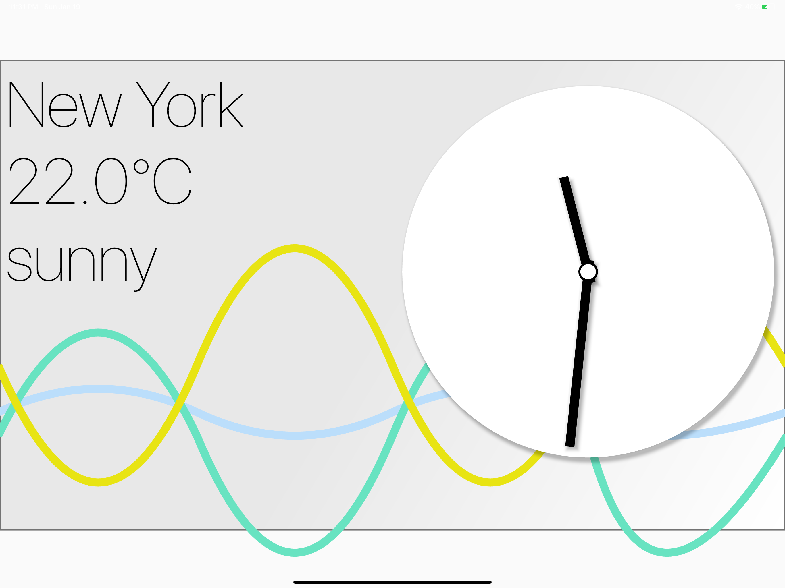
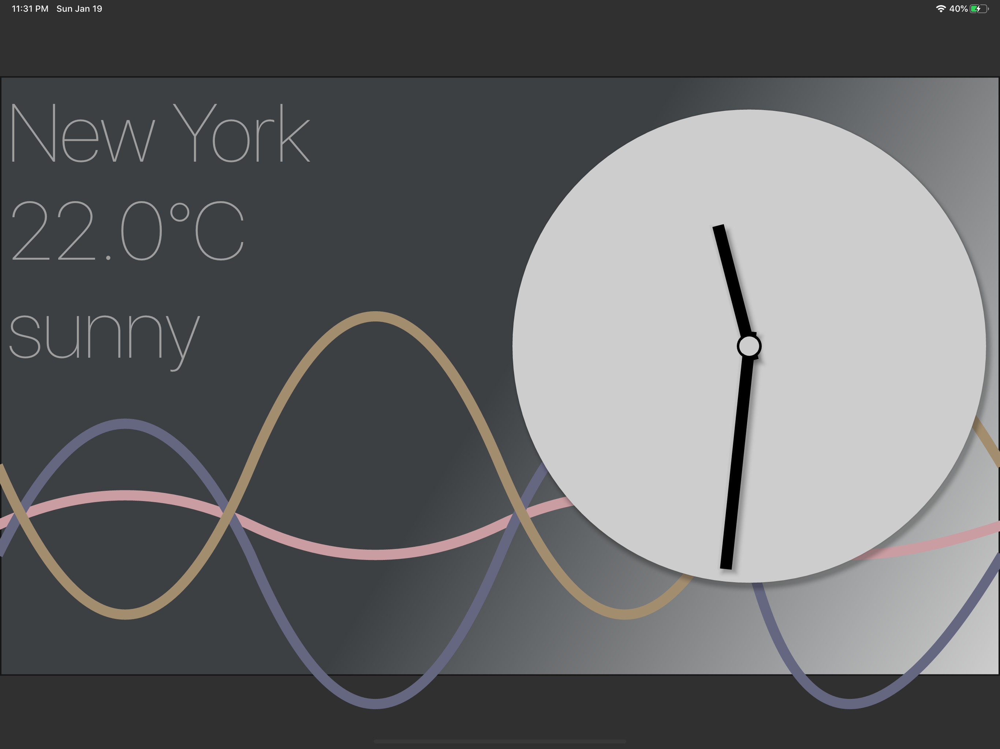

# Flutter Clock

Welcome to Flutter Clock!

See [flutter.dev/clock](https://flutter.dev/clock) for how to get started, submission requirements, contest rules, and FAQs.

See a [live demo](https://maryx.github.io/flutter_clock) with Flutter for Web!

